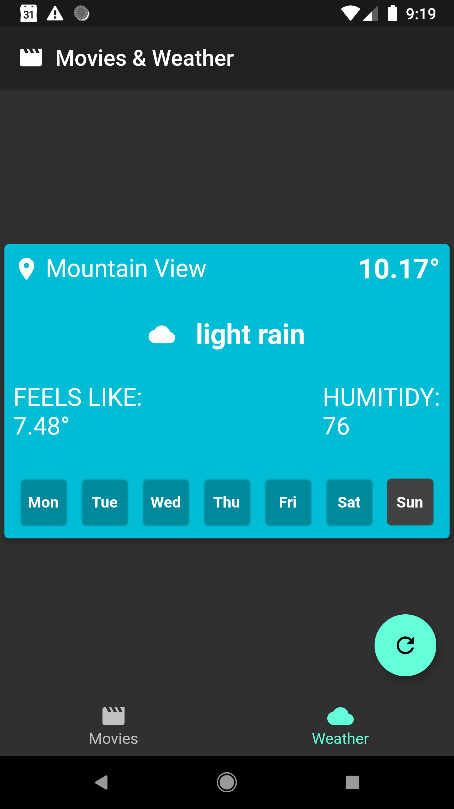

# Prospera Exercise

A Prospera coding interview exercise

## How to Use

**Step 1:**

Download or clone this repo by using the link below:

```
https://github.com/omergamliel3/prospera-exercise.git
```

**Step 2:**

Go to project root and execute the following command in console to get the required dependencies:

```
flutter pub get
```

**Step 3:**

This project uses libraries that works with code generation, execute the following command to generate files:

```
flutter packages pub run build_runner build --delete-conflicting-outputs
```

or watch command in order to keep the source code synced automatically:

```
flutter packages pub run build_runner watch
```

**Step 4:**

Execute the following command to run the app (you must have an open android emulator):

```
flutter run -t lib/main/main_dev.dart
```

<br />
<br />

## Screenshots



 

<br />
<br />

## Technologies

### Architecture

- **[Test-driven-design style](https://github.com/ResoCoder/flutter-tdd-clean-architecture-course)**
- **[MVC](https://en.wikipedia.org/wiki/Model%E2%80%93view%E2%80%93controller)**

<br />
<br />


<br />
<br />

### Design Patterns

- **Repository Pattern**
- **Strategy Pattern**

### Front-end

- **[Flutter SDK (front-end framework)](https://github.com/flutter/flutter)**
- **[Kiwi (dependency injection)](https://github.com/vanlooverenkoen/kiwi)**
- **[Sailor (navigation manager)](https://pub.dev/packages/sailor)**
- **[Bloc (event driven state managment)](https://github.com/felangel/bloc/tree/master/packages/flutter_bloc)**
- **[Retrofit (API integration)](https://github.com/trevorwang/retrofit.dart/)**

### Back-end

- **[Weather API](https://openweathermap.org/api)**
- **[OMDb API](http://www.omdbapi.com/)**

# Author 🙋

- **Omer Gamliel** - [LinkedIn](https://www.linkedin.com/in/omer-gamliel-6a813a188/)
